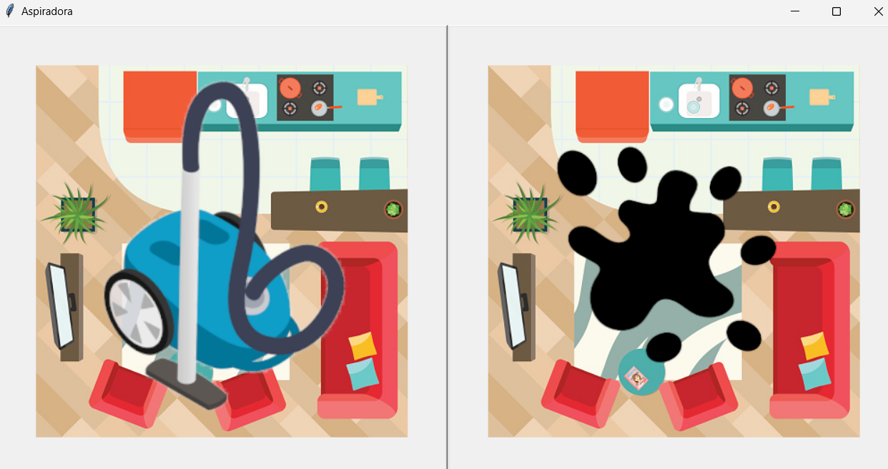
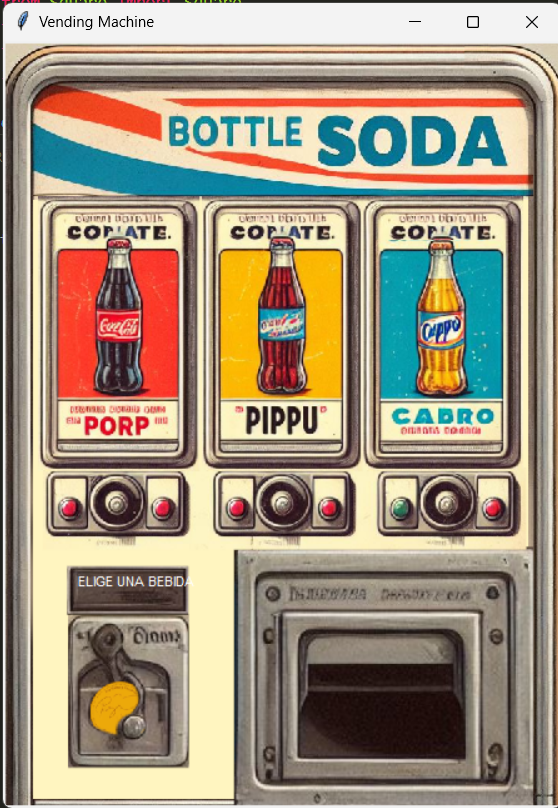
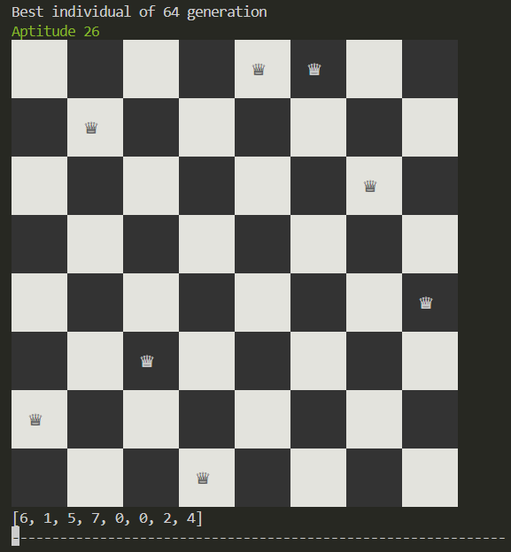
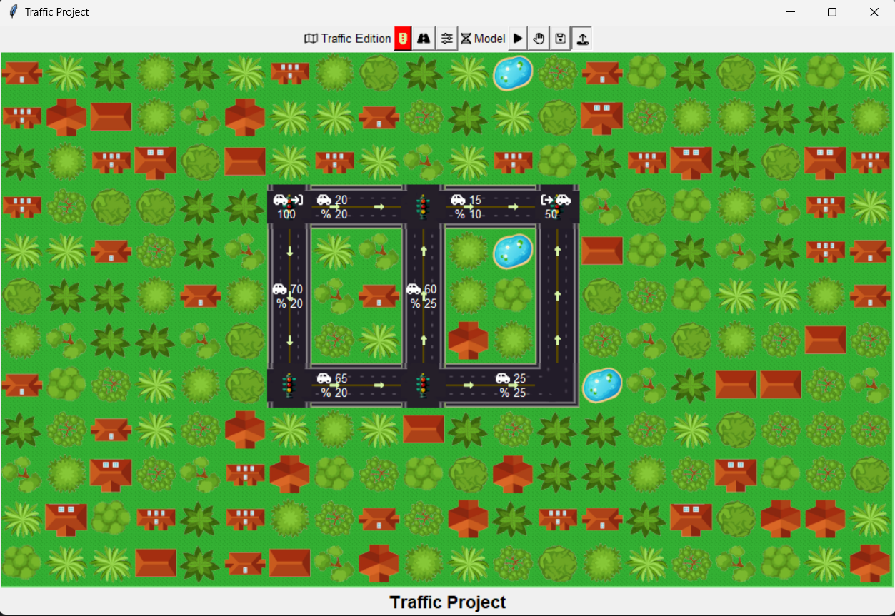
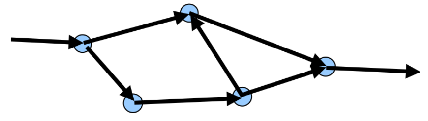

# REPOSITORY FOR IA1
## PRACTICE 1 - CleanPractice
#### Problem
Una aspiradora inteligente vive en un mundo simple, dos cuadros A y B. La aspiradora puede percibir en que cuadro se encuentra. También puede percibir si el cuadro está sucio.

Puede elegir si se mueve a la derecha o izquierda, aspirar suciedad o no hacer nada.

Implemente un programa que represente a la aspiradora y su mundo. Y que el usuario pueda *ensuciar algún cuadrante* para que la aspiradora lo limpie.

Cree dos formas de comportamiento para la aspiradora: estúpida o inteligente



### Version 1
#### Tools
* Python 3.2.1
* Python Libraries: 
	- tkinter
	- threading
	- time
	- sys

#### How to run
1. Open a console on directory that contains *main.py*
2. Run the command, sending the mode for the vacuum cleaner (**1** if is not stupid)

```
python main.py [isCleaned]
```

3. Click over the square for dirtying and see what the vacuum do.

#### Modes

##### Stupid
The vacuum cleaner choose randomly between *clean*, *move* or *doing nothing*.

##### Intelligence
The vacuum cleaner checks if the square it is located in is not already clean for *clean* it, then *move* it to the another square.

### Version 2
#### Changes
Added a model for clean, this model waits 2 seconds in every square before changing position. For more information about the model, is already added the file _model.txt_ that contains all the information.

#### How to run
1. Open a console on directory _CleanPractice/v2_ that contains *main.py*
2. Run the command

```
python main.py
```

3. Click over the square for dirtying and see what the vacuum do.

## PRACTICE 2 - VendingPractice



### Tools
* Python 3.2.1
* Python Libraries: 
	- tkinter
	- threading
	- time
	- sys

### Problem
Modelar una máquina expendedora de refrescos como un agente reactivo simple. Este agente solo tiene un sensor que percibe cuando se ingresa una moneda o cuando se selecciona alguno de los 3 refrescos disponibles.

### How to run
1. Open a console on directory _VendingPractice_ that contains *main.py*
2. Run the command

```
python main.py
```

3. Click over the space for insert coin or an option of soda. Additional, is added a click area for get the sodas.

## PRACTICE 3 - EightQueensPractice



### Tools
* Python 3.2.1
* Python Libraries: 
	- random
	- colorama
	- time
### Problem
Modelar un algoritmo génetico que resuelva el problema de las 8 reinas, consistiendo este de colocar 8 reinas en el tablero de ajedrez, sin que ninguna de ellas se ataquen.

### How to run
1. Open the *main.py* on directory _EightQueensPractice_
2. Change the values of the variables *MAX_GENERATIONS* and *SIZE_POPULATION* to the desired ones.
3. Open a console and run the command

```
python main.py
```

## PROJECT 1 - Traffic Generational Model



### Tools
* Python 3.2.1
* Python Libraries: 
	- random
	- tkinter
	- pickle
    - copy

### Objetivos generales
- Aplicación de algoritmos genéticos en la resolución de problemas reales.

### Objectivos específicos
- Plantear un problema en base a algoritmos genéticos.
- Uso de lenguaje Python
- Aplicar buenas prácticas de programación.

### Descripción
Usted trabaja para la empresa de desarrollo de software “Code ‘n Bugs” la cual está trabajando con la municipalidad de su ciudad para abordar el problema de tráfico en la ciudad.

El tráfico es un sistema con pocas variables para el cual es bastante fácil hallar una respuesta pero la tarea es extremadamente larga debido a la gran cantidad de calles y cruces, de modo que la tarea aunque simple es repetitiva y de una gran tamaño debido a la cantidad de calles en el modelo a evaluar; por lo que hallar la respuesta por ensayo de prueba y error es algo impráctico.

Estas características le vuelven un excelente candidato para buscar una solución al problema haciendo uso de algoritmos genéticos; este método ofrece una buena solución al problema más no así la mejor de todas las soluciones.

El objetivo del sistema es conducir la mayor cantidad de autos hacia los extremos de salida del sistema por medio del proceso de encontrar el mejor porcentaje de tiempo que da paso cada semáforo a cada calle.

### Modelado de calles de la ciudad
La representación del sistema de calles, capacidad de calles, cruces, semáforos y sentido de las calles se puede dar a través un grafo como el que se presenta a continuación:



Donde en cada uno de los nodos representa un cruce con al menos estas propiedades:
- % de tiempo que da paso de una arista a otra

Eso quiere decir que cada nodo cuenta con semáforos necesarios para dar paso a las diferentes aristas que parten de dicho nodo.

Se tiene la opción de aplicar restricciones a nodos sobre el porcentaje mínimo de tiempo de paso entre dos aristas, esto es para garantizar que para calles principales (como la calle Rodolfo Robles) no se elimine el paso de vehículos a través de dicha calle.

Para el caso de las aristas (calles) se tienen al menos estas propiedades:
- Dirección: sentido de la calle, va de un extremo al otro.
- Capacidad: es la cantidad de vehículos que pueden transitar a través de ella en un instante dado.
- Hay aristas especiales que en uno de sus extremos no conectan con ningún nodo, dependiendo de su sentido son entradas o salidas del sistema, y pueden representan las calles que permiten el ingreso de vehículos a la ciudad, salidas de edificios de donde salen vehículos para regresar a sus casas, salidas de la ciudad, etc.

### Requerimientos
La aplicación debe ser una aplicación de escritorio que permita de forma gráfica y amigable la configuración de modelos del sistema de calles y, a través de un algoritmo genético encontrar la solución.

Al finalizar la ejecución del algoritmo, la solución debe ser mostrada de forma gráfica indicando toda la información pertinente para cada arista, nodo y semáforo, se pueden usar herramientas como Graphviz. También se debe mostrar la cantidad de vehículos que salen del sistema y la eficiencia lograda.

Durante cada paso de la configuración del modelo se debe tener la opción de previsualizar el sistema, se pueden usar herramientas como Graphviz.

Antes de la ejecución del algoritmo genético se pueden configurar los siguientes aspectos:
- Tamaño de la población
- Tasa de mutación: X cantidad de mutaciones por cada Y generaciones.
- Escoger el criterio de finalización:
	- Número de generaciones, o
	- Porcentaje de eficiencia

Durante la ejecución del algoritmo, el usuario debe poder ver por cada generación el porcentaje de eficiencia del mejor individuo de esa generación.

La aplicación debe permitir al usuario en cualquier momento detener la ejecución del algoritmo genético mostrando como solución el mejor individuo de la última generación completada.

La aplicación debe permitir guardar los modelos para que cuando se vuelva a ejecutar la aplicación el usuario pueda usar algún modelo previamente guardado.

## PerceptronSimplePractice
Realizar el código correspondiente a un perceptron que devuelva el valor de una compuerta or y and siguiendo los siguientes pasos:
1. Iniciar pesos y umbral (sesgo) de forma aleatoria
2. Aplicar las entradas a la red
3. Calcular la salida ‘z’
4. Comparar el resultado obtenido con el deseado. A la diferencia entre ambos se llama ‘error’ (‘e’)
5. Modificar pesos y umbral según el error obtenido
6. Repetir hasta que el error esté dentro de un rango aceptable (< 1%)
