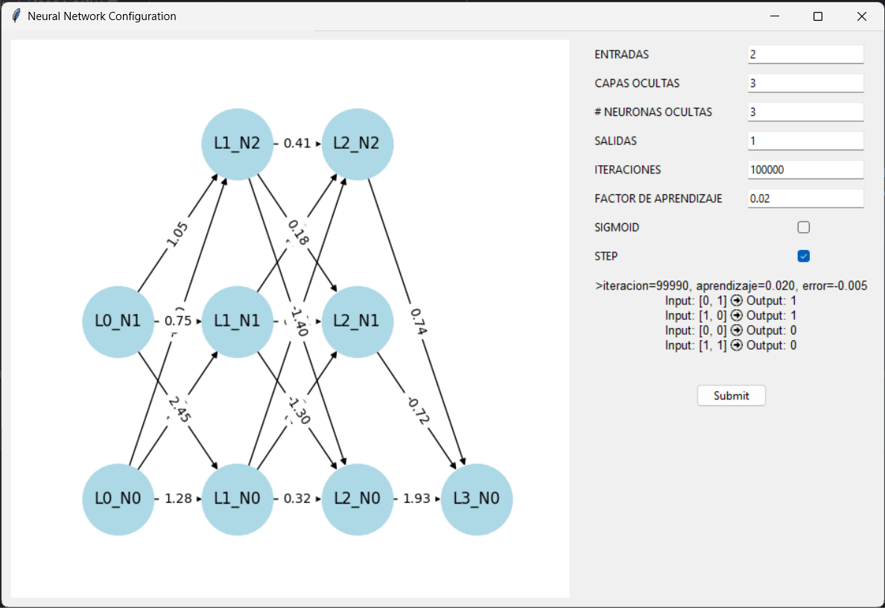

# REPOSITORY FOR IA1
## PRACTICE 1 - CleanPractice
#### Problem
An intelligent vacuum cleaner lives in a simple world, two frames A and B. The vacuum cleaner can sense which frame it is in. It can also sense if the frame is dirty.

It can choose whether to move left or right, suck up dirt or do nothing.

Implement a program that represents the vacuum cleaner and its world. And that the user can *dirt some quadrant* for the vacuum cleaner to clean it.

Create two forms of behavior for the vacuum cleaner: stupid or smart.


### Version 1
#### Tools
* Python 3.2.1
* Python Libraries: 
	- tkinter
	- threading
	- time
	- sys

#### How to run
1. Open a console on directory that contains *main.py*
2. Run the command, sending the mode for the vacuum cleaner (**1** if is not stupid)

```
python main.py [isCleaned]
```

3. Click over the square for dirtying and see what the vacuum does.

#### Modes

##### Stupid
The vacuum cleaner choose randomly between *clean*, *move* or *doing nothing*.

##### Intelligence
The vacuum cleaner checks if the square it is located in is not already clean for *clean* it, then *move* it to the another square.

### Version 2
#### Changes
Added a model for clean, this model waits 2 seconds in every square before changing position. For more information about the model, is already added the file _model.txt_ that contains all the information.

#### How to run
1. Open a console on directory _CleanPractice/v2_ that contains *main.py*
2. Run the command

```
python main.py
```

3. Click over the square for dirtying and see what the vacuum does.

## PRACTICE 2 - VendingPractice


### Tools
* Python 3.2.1
* Python Libraries: 
	- tkinter
	- threading
	- time
	- sys

### Problem
Model a soft drink vending machine as a simple reactive agent. This agent has only one sensor that senses when a coin is inserted or when one of the 3 available soft drinks is selected.
### How to run
1. Open a console on directory _VendingPractice_ that contains *main.py*
2. Run the command

```
python main.py
```

3. Click over the space for insert coin or an option of soda. Additional, is added a click area for get the sodas.

## PRACTICE 3 - EightQueensPractice


### Tools
* Python 3.2.1
* Python Libraries: 
	- random
	- colorama
	- time
### Problem
Model a genetic algorithm that solves the 8 queens problem, consisting of placing 8 queens on the chessboard, without any of them attacking each other.

### How to run
1. Open the *main.py* on directory _EightQueensPractice_
2. Change the values of the variables *MAX_GENERATIONS* and *SIZE_POPULATION* to the desired ones.
3. Open a console and run the command

```
python main.py
```

## PROJECT 1 - Traffic Generational Model


### Tools
* Python 3.2.1
* Python Libraries: 
	- random
	- tkinter
	- pickle
    - copy

### General Objectives
- Application of genetic algorithms in solving real problems.

### Specific Objectives
- Problem posing based on genetic algorithms.
- Use of Python language
- Apply good programming practices.

### Description
You work for the software development company "Code 'n Bugs" which is working with the municipality of your city to address the traffic problem in the city.

Traffic is a system with few variables for which it is quite easy to find an answer but the task is extremely long due to the large number of streets and intersections, so the task although simple is repetitive and of a large size due to the number of streets in the model to be evaluated; so finding the answer by trial and error is somewhat impractical.

These characteristics make it an excellent candidate for finding a solution to the problem using genetic algorithms; this method offers a good solution to the problem but not the best of all solutions.

The objective of the system is to drive as many cars as possible to the exit ends of the system through the process of finding the best percentage of time that each traffic light gives way to each street.

### City street modeling
The representation of the street system, street capacity, intersections, traffic lights and direction of the streets can be given through a graph like the one presented below:


Where in each of the nodes represents a crossing with at least these properties:
- % of time that gives passage from one edge to another.

This means that each node has the necessary traffic lights to give passage to the different edges that start from that node.

There is the option of applying restrictions to nodes on the minimum percentage of passing time between two edges, this is to ensure that for main streets (such as Rodolfo Robles street) the passage of vehicles through that street is not eliminated.

In the case of edges (streets) we have at least these properties:
- Direction: direction of the street, it goes from one end to the other.
- Capacity: the number of vehicles that can pass through it at a given time.
- There are special edges that at one of their ends do not connect with any node, depending on their direction they are entrances or exits of the system, and can represent the streets that allow the entrance of vehicles to the city, exits of buildings from where vehicles leave to return to their homes, exits of the city, etc.
### Requirements
The application must be a desktop application that allows in a graphical and friendly way the configuration of street system models and, through a genetic algorithm to find the solution.

At the end of the algorithm execution, the solution should be displayed graphically indicating all relevant information for each edge, node and traffic light, tools such as Graphviz can be used. The number of vehicles exiting the system and the efficiency achieved should also be displayed.

During each step of the model configuration there should be the option to preview the system, tools such as Graphviz can be used.

Before the execution of the genetic algorithm the following aspects can be configured:
- Population size.
- Mutation rate: X number of mutations per Y generations.
- Choose the termination criterion:
	- Number of generations, or
	- Efficiency percentage

During the execution of the algorithm, the user must be able to see for each generation the efficiency percentage of the best individual of that generation.

The application must allow the user at any time to stop the execution of the genetic algorithm by displaying the best individual of the last completed generation as the solution.

The application must allow the user to save the models so that when the application is run again the user can use any previously saved model.

## PerceptronSimplePractice
Create the code corresponding to a perceptron that returns the value of an or and gate by following the steps below:
1. Initialize weights and threshold (bias) randomly 2.
2. Apply the inputs to the network
3. Calculate the output 'z
4. Compare the obtained result with the desired one. The difference between the two is called 'error' ('e').
5. Modify weights and threshold according to the obtained error
6. Repeat until the error is within an acceptable range (< 1%).

## PRACTICE - Neuronal network with backpropagation



### Tools
* Python 3.2.1
* Python Libraries: 
	- random
	- tkinter
	- matplotlib
    - networkx
    - math

### Description
There are decision problems that cannot be solved with two-layer neural networks (nonlinear problems). To solve these problems, neural networks have hidden layers and thousands of neurons that must be tuned to learn based on supervised learning.

Supervised learning allows the neural network to be trained based on example cases, comparing the expected value with the obtained value and adjusting the weights in backpropagation.

The company Code 'n Bugs hires him to implement a library that allows neural networks to be configured, trained and, once trained, used.
### Requirements and limitations
- Both inputs and outputs only accept numeric values.
- For a neural network the user must define the number of inputs and outputs.
- For a neural network the user must define the number of hidden layers, and for each hidden layer the number of neurons must be indicated.
- For a neural network the user can define the activation function applied for the hidden layers. The options are the sigmoid function and the hyperbolic tangent function. If not specified then the default function is Sigmoid.
- For a neural network the user can define the activation function applied for the output layer. The options are the identity function and the step function, the default is the step function.
- Supervised learning with backpropagation should be implemented. A log should be displayed during training showing information about learning 

### Technical Manual
The neuronal network presented can be confused, this because doesn't use the numpy library, with this library the process can be more simplified, this because with dot can calculate all activations in a layer or use T function for transpose and use the arrays more efficiently.

#### Overview
The Network class implements a simple feedforward neural network with configurable architecture, activation functions, and learning parameters. It includes methods for initialization, forward propagation, and backpropagation, allowing the network to learn from input data through supervised training.

#### Parameters
- **n_input**: Number of input neurons.
- **n_hidden**: Number of hidden layers.
- **n_output**: Number of output neurons.
- **n_hidden_neurons**: Number of neurons in each hidden layer.
- **learning_rate**: Learning rate for the network.
- **epochs**: Number of training epochs.
- **is_sigmoid**: Boolean indicating if sigmoid function should be used for activation.
- **is_step**: Boolean indicating if step function should be used for final activation.

#### Methods

##### Activation Functions
- **sigmoid(x)** Calculates the sigmoid activation function
- **tanh(x)** Calculates the hyperbolic tangent activation function
- **step(x)** Step function for final activation, returning 1 if `x > 0.5`, otherwise 0
- **identity(x)** Identity function for final activation, returning `x`

##### Initialization
- **initialization()** Generates and initializes random weights and biases bases on the network architecture

##### Forward propagation
- **forward_propagation(x, weights, biases)** Propagates the input `x` through the network using the given weights and biases, returning the activations of each layer

##### Backpropagation
- **backpropagation(x, y, visual=None)** Performs backpropagation to update weights and biases based on the input `x` and expected output `y`. If `visual` is provided, updates the visual representation every 10 epochs.

##### Final activation
- **final_activation_function(x)** Returns the final activation function based on step or identity functions.

#### Considerations
- The sigmoid and hyperbolic tangent functions were used for transfer the values of activation for the next layer and neuron.
- The step and identity functions were used for final activation.
- For simplicity only it can be set a number of neurons for each hidden layer, this means if it has 3 hidden layers and set 3 neurons for hidden layer, all the 3 hidden layers will have 3 neurons.
- Is necessary have installed all the libraries before run the main.py
- The visual app use the FontAwesome font.

### User's Manual

#### Overview
This manual provides a comprehensive guide on how to use the Neural Network Configuration Tool, which is based on the Network class implemented in Python. The tool allows users to configure and train a feedforward neural network with custom parameters and visualize the network's structure and training progress.

#### Interface Description
##### Input Fields
- "Entradas" (Inputs): Number of input neurons. Specify the number of features in your input data.
- Capas Ocultas (Hidden Layers): Number of hidden layers in the network.
- #Neuronas Ocultas (Hidden Neurons): Number of neurons in each hidden layer.
- Salidas (Outputs): Number of output neurons. This should match the number of classes or regression targets.
- Iteraciones (Iterations): Number of training epochs. Higher values typically improve learning but increase computation time.
- Factor de Aprendizaje (Learning Rate): Learning rate for the network. Determines the step size during gradient descent.
- Sigmoid: Checkbox to select the sigmoid function as the activation function for hidden neurons.
- Step: Checkbox to select the step function as the final activation function for output neurons.

#### Visual Representation
The network's structure is visualized with nodes representing neurons and arrows indicating the connections between them.
The weights of the connections are displayed as labels on the arrows.

#### Status Display
Displays the current training iteration, learning rate, and error for each epoch.
Shows the input and output pairs for the network's predictions after training.

#### Controls
- Submit Button: Starts the training process with the specified configuration and shows the final solution for `XOR PROBLEM`.

#### Using the Tool

##### Step-by-Step Guide

###### Configure the Network:
- Enter the desired number of inputs, hidden layers, hidden neurons, and outputs in the respective fields.
- Set the number of iterations for training.
- Specify the learning rate for the network.
- Select the activation functions by checking the "Sigmoid" and/or "Step" checkboxes.

###### Visualize the Network:

Observe the visual representation of the final network structure of weights on the left side of the interface. The nodes (circles) represent neurons, and the arrows represent the connections (weights) between them.
The labels on the arrows show the weights assigned to each connection.

###### Start Training:
- Click the "Submit" button to begin the training process.
- The status display will update with the current training iteration, learning rate, and error value.

###### Monitor Training Progress:

Training progress is displayed in real-time, showing the current iteration, learning rate, and error.
The predictions for the input-output pairs will be updated and displayed when the network is already trained.

###### Analyze Results:

After the training completes, analyze the final weights and biases of the network.
Evaluate the network's performance based on the displayed input-output predictions.

#### Example Configuration
##### Input Configuration
- Inputs: 2
- Hidden Layers: 3
- Hidden Neurons: 3
- Outputs: 1
- Iterations: 100000
- Learning Rate: 0.02
- Activation Functions:
- Sigmoid: Unchecked
- Step: Checked

##### Start Training
- Click "Submit" to start the training process.
- Monitor the status display for training updates.

#### Tips for Effective Use
- _Learning Rate_: If the learning rate is too high, the network may not converge; if too low, training may be very slow. Adjust based on performance.
- _Iterations_: More iterations can lead to better learning but also require more computation time.
- _Hidden Layers and Neurons_: Experiment with different numbers to find the optimal network architecture for your specific problem.
- _Activation Functions_: Choose based on the nature of the problem. Sigmoid functions are good for probabilities, while step functions are suitable for binary classification.

#### Troubleshooting
##### Network Not Converging
- Try decreasing the learning rate.
- Increase the number of iterations.
- Ensure that the network architecture is suitable for the complexity of the problem.

##### High Error Values:
- Check if the data is normalized or scaled properly.
- Increase the number of hidden neurons or layers if the network is underfitting.
- Reduce the number of hidden neurons or layers if the network is overfitting.

##### Unexpected Outputs:
- Verify the configuration of activation functions.
- Ensure that the input data matches the expected format and scale.
- By following this user manual, you should be able to effectively configure, train, and evaluate neural networks using the Neural Network Configuration Tool.